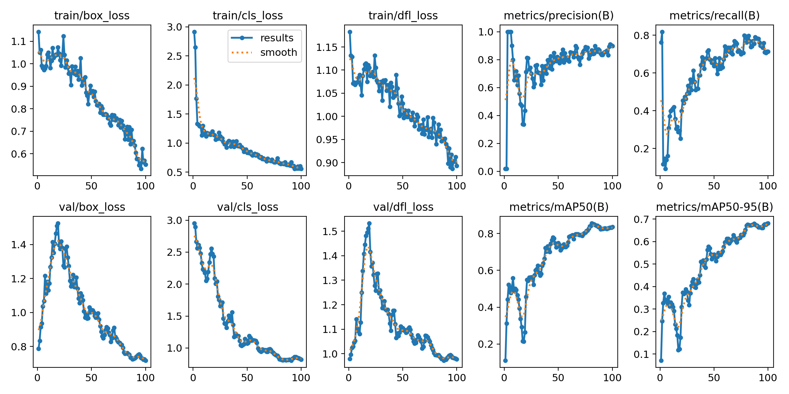
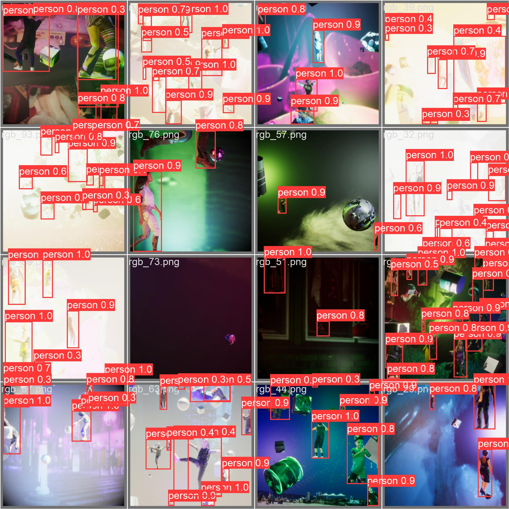

# 🚀 Yolov8 + PeopleSansPeople training Pipeline

## 📝 Description


## 🛠️ Installation

Follow these steps to get a development environment running:

1. Clone the repository:
    ```shell
    git clone https://github.com/arjvn/yolov8_human_sim.git
    ```
2. Navigate to the project directory:
    ```shell
    cd yolov8_human_sim
    ```
3. Run the start script:
    ```shell
    bash start.bash
    ```

## 🎯 Usage

When running `start.bash`, you will be prompted to enter an experiment name. If you press Enter without typing anything, the default value "default-experiment" will be used.

The script will then clone the PeopleSansPeople repository, download a specific version of the project, and run a script to generate a dataset. The path to this dataset will be logged, and the dataset will be copied to a specific location in the PeopleSansPeople directory.

Finally, the script will build and run a Docker image for the YOLOv8 project.


## 🔑 Key Files

### Create_yolo_labels.py

This file is responsible for creating YOLO labels for the dataset. It takes the input images and their corresponding annotations
and generates YOLO labels in the required format. The YOLO labels are used for training the YOLO object detection model.

Functions:
- create_yolo_labels: This function takes the input images and annotations and generates YOLO labels.

Usage:
```shell
python create_yolo_labels.py --images_dir <path_to_images_directory> --annotations_dir <path_to_annotations_directory> --output_dir <path_to_output_directory>
```

### ScenarioConfiguration.json


This file contains the configuration settings for the scenario. It defines various parameters and options that are used during the
execution of the scenario.

Attributes:
- scenario_name: The name of the scenario.
- scenario_description: A brief description of the scenario.
- model_path: The path to the trained YOLO model.
- image_size: The size of the input images for the YOLO model.
- confidence_threshold: The confidence threshold for object detection.
- nms_threshold: The threshold for non-maximum suppression.
- classes: The list of classes for object detection.

Example:
```json
{
    "scenario_name": "Object Detection",
    "scenario_description": "Detect objects in images using YOLO model",
    "model_path": "models/yolov8.weights",
    "image_size": 416,
    "confidence_threshold": 0.5,
    "nms_threshold": 0.4,
    "classes": ["person", "car", "dog"]
}
```

### Train_yolov8.py


This file is responsible for training the YOLOv8 object detection model. It takes the input dataset and configuration settings
and trains the model using the YOLOv8 architecture.

Functions:
- load_dataset: This function loads the dataset for training.
- build_model: This function builds the YOLOv8 model.
- train_model: This function trains the YOLOv8 model.

Usage:
```shell
python train_yolov8.py --dataset_dir <path_to_dataset_directory> --config_file <path_to_configuration_file> --output_dir <path_to_output_directory>
```

## 📊 Results

Here you can include the results of your project, such as accuracy metrics, performance benchmarks, or any other relevant data.

<div align="center">
    <figure>
        
        <figcaption style="text-align: center;">Training Graphs</figcaption>
    </figure>
</div>
<div>
    <figure>
        
        <figcaption style="text-align: center;">Labels for Validation Batch 0</figcaption>
    </figure>
    <figure>
        
        <figcaption style="text-align: center;">Predictions for Validation Batch 0</figcaption>
    </figure>
</div>
## 🤝 Contributing

Details on how to contribute to this project.

## 📜 License

Information about the license.

