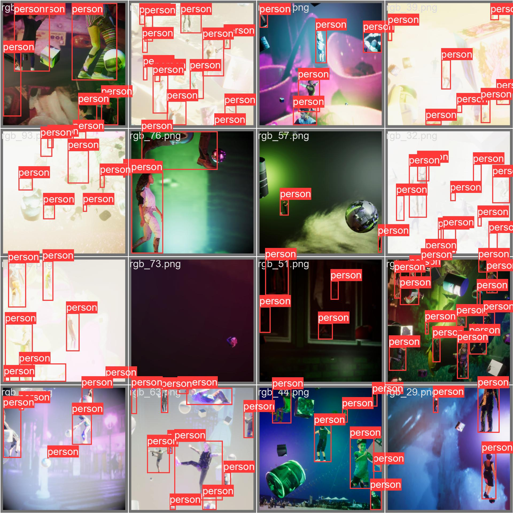

# 🚀 Yolov8 + PeopleSansPeople training Pipeline

## 📝 Description

A brief description of what this project does and who it's for.

## 🛠️ Installation

Follow these steps to get a development environment running:

1. Clone the repository:
    ```shell
    git clone https://github.com/yourusername/your-repo.git
    ```
2. Navigate to the project directory:
    ```shell
    cd your-repo
    ```
3. Run the start script:
    ```shell
    bash start.bash
    ```

## 🎯 Usage

When running `start.bash`, you will be prompted to enter an experiment name. If you press Enter without typing anything, the default value "default-experiment" will be used.

The script will then clone the PeopleSansPeople repository, download a specific version of the project, and run a script to generate a dataset. The path to this dataset will be logged, and the dataset will be copied to a specific location in the PeopleSansPeople directory.

Finally, the script will build and run a Docker image for the YOLOv8 project.

## 📊 Results

Here you can include the results of your project, such as accuracy metrics, performance benchmarks, or any other relevant data.


 

## 🤝 Contributing

Details on how to contribute to this project.

## 📜 License

Information about the license.

